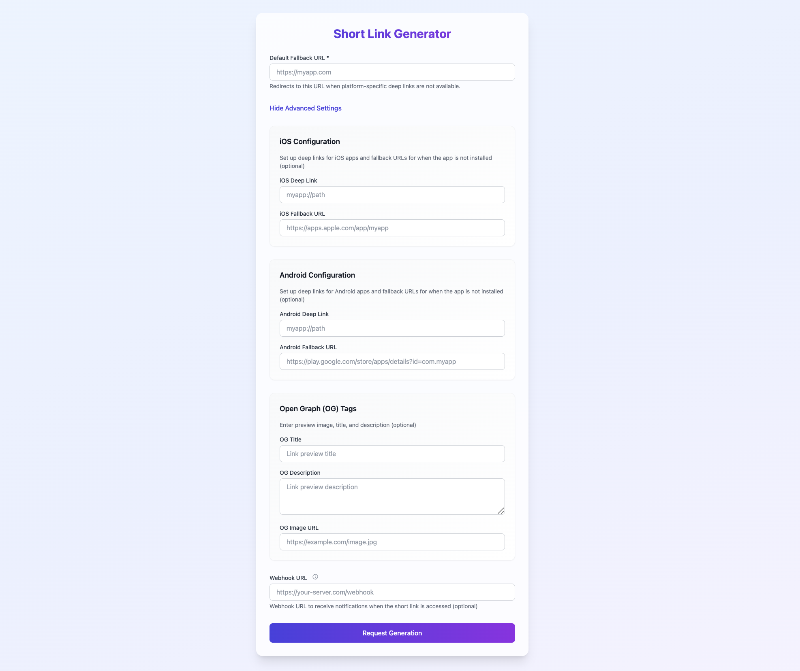

# URL Shortening Service (Golang)

[한국어](README.md) | [English](README.en.md)

🚀 **Demo Site:** [https://f-it.kr](https://f-it.kr)




## 👋 Introduction

A modern and efficient URL shortening service developed in Go language. This service goes beyond simple URL shortening, providing various advanced features such as deep link handling, platform-specific redirections, JWT-based API authentication, and more to satisfy both user experience and security.

## ✨ Key Features

| Feature | Description |
| -------------------- | -------------------------------------------------------------------- |
| **Efficient URL Generation** | Creates shortened URLs quickly and reliably through a collision-free unique key generation algorithm. |
| **Deep Link Handling** | Detects iOS/Android platforms and redirects to app deep links, or to specified fallback URLs if the app is not installed. |
| **JWT Authentication** | Issues guest JWT tokens upon initial web UI access, and certain API endpoints only allow authenticated requests through JWT. |
| **Fallback URL Support** | Sets fallback URLs for each platform (iOS, Android) and a default fallback URL to flexibly respond to various situations such as app not being installed. |
| **Webhook Integration** | Sends real-time notifications (POST requests) to specified URLs when shortened URLs are accessed, facilitating data collection and analysis. |
| **Custom OG Tags** | Allows direct configuration of OG (Open Graph) tags (title, description, image) used for link previews. |

## 🛠️ Core Technologies and Design

### Short Key Generation Method ([`pkg/short_key.go`](https://www.google.com/search?q=url-shortener-go/pkg/short_key.go), [`pkg/rand.go`](https://www.google.com/search?q=url-shortener-go/pkg/rand.go) reference)

This service uses the following method for secure and unpredictable short key generation:

1. **Unique ID Generation**: When URL information is stored in the database, it is assigned a unique numeric ID (Auto Increment).
2. **Base62 Encoding**: The issued numeric ID is encoded in Base62 to convert it into a short string. (Using the `github.com/jxskiss/base62` library)
3. **Random String Addition**: A 2-character random string is generated and added to the Base62 encoded string, with one character at the beginning and one at the end.
   * Example: Random string "ab", ID encoded value "cde" → Final short key "acdeb"

This method has the following advantages:

* **Guaranteed Uniqueness**: Based on database IDs, so collisions do not occur.
* **Enhanced Security**: Random string addition makes sequential key guessing difficult.
* **Consistent Performance**: Ensures stable key generation speed regardless of database size.

### System Architecture

* **API Server**: Implemented using the Fiber web framework. ([`api/server.go`](https://www.google.com/search?q=url-shortener-go/api/server.go), [`main.go`](https://www.google.com/search?q=url-shortener-go/main.go))
* **Database**: Uses PostgreSQL by default, interacting through GORM. ([`config/db.go`](https://www.google.com/search?q=url-shortener-go/config/db.go), [`model/url.go`](https://www.google.com/search?q=url-shortener-go/model/url.go))
* **Cache**: Uses Redis to cache frequently accessed URL information to improve response speed. ([`config/cache.go`](https://www.google.com/search?q=url-shortener-go/config/cache.go), [`api/handler.go`](https://www.google.com/search?q=url-shortener-go/api/handler.go))
* **Configuration Management**: Manages environment variables through `.env` file. ([`config/env.go`](https://www.google.com/search?q=url-shortener-go/config/env.go))
* **Error Tracking**: Integrates with Sentry to monitor and analyze errors in real-time. ([`main.go`](https://www.google.com/search?q=url-shortener-go/main.go))

## ⚙️ Technology Stack

* **Language**: Go
* **Web Framework**: [Fiber](https://gofiber.io/)
* **Database**: [PostgreSQL](https://www.postgresql.org/) (Using GORM library)
* **Cache**: [Redis](https://redis.io/)
* **JSON Processing**: [jsoniter](https://github.com/json-iterator/go)
* **Environment Variable Management**: [godotenv](https://github.com/joho/godotenv)
* **JWT (JSON Web Token)**: [golang-jwt/jwt](https://github.com/golang-jwt/jwt)
* **Base62 Encoding**: [jxskiss/base62](https://github.com/jxskiss/base62)
* **Validation**: [go-playground/validator](https://github.com/go-playground/validator)

## 🚀 Getting Started

### Prerequisites

* Go (version 1.18 or higher recommended)
* PostgreSQL
* Redis
* Git

### Installation and Execution

1. **Clone Repository**:

   ```bash
   git clone https://github.com/lee-lou2/url-shortener-go.git
   cd url-shortener-go
   ```

2. **Set Environment Variables**:
   Create a `.env` file in the root directory and modify the following content according to your project environment.

   ```env
   # SERVER
   SERVER_PORT=
   JWT_SECRET=
   ENCRYPT_COOKIE_KEY=
   RUN_MIGRATIONS=true  # Control with environment variables to skip automatic migrations in test environments

   # DATABASE
   DB_HOST=localhost
   DB_PORT=5432
   DB_USER=
   DB_PASSWORD=
   DB_NAME=

   # REDIS
   REDIS_HOST=localhost
   REDIS_PORT=6379
   REDIS_PASSWORD=

   # SENTRY
   SENTRY_DSN=
   ```

3. **Download Required Go Packages**:

   ```bash
   go mod tidy
   ```

4. **Database Migration**:
   When the application runs, GORM's `AutoMigrate` feature automatically creates or updates the `urls` table. (See the `init` function in [`model/url.go`](https://www.google.com/search?q=url-shortener-go/model/url.go))

5. **Run the Application**:

   ```bash
   go run main.go
   ```

   Once the server starts, it can be accessed at `http://localhost:3000` by default.

## 📖 API Reference

The main API endpoints are as follows: (See [`api/route.go`](https://www.google.com/search?q=url-shortener-go/api/route.go), [`api/handler.go`](https://www.google.com/search?q=url-shortener-go/api/handler.go))

* **`GET /`**:

    * Description: Provides a web UI for the URL shortening service.
    * Response: HTML page (`views/index.html`) and a guest JWT token (`{{.Token}}`) for API calls.

* **`POST /v1/urls`**:

    * Description: Creates a new shortened URL.
    * Authentication: Requires a valid JWT token in the `Authorization: Bearer <token>` header. (Applies the `jwtAuth` middleware from [`api/middlewares.go`](https://www.google.com/search?q=url-shortener-go/api/middlewares.go))
    * Request Body (JSON): (See the `createShortUrlRequest` struct in [`api/schemas.go`](https://www.google.com/search?q=url-shortener-go/api/schemas.go))
      ```json
      {
          "iosDeepLink": "myapp://path",
          "iosFallbackUrl": "https://apps.apple.com/app/myapp",
          "androidDeepLink": "myapp://path",
          "androidFallbackUrl": "https://play.google.com/store/apps/details?id=com.myapp",
          "defaultFallbackUrl": "https://myapp.com", // Required
          "webhookUrl": "https://your-server.com/webhook",
          "ogTitle": "Link Preview Title",
          "ogDescription": "Link Preview Description",
          "ogImageUrl": "https://example.com/image.jpg"
      }
      ```
      Validation is performed for each field.
    * Success Response (200 OK):
      ```json
      {
          "message": "URL created successfully",
          "short_key": "generatedShortKey"
      }
      ```
      If a URL with identical settings already exists, it returns that information.
    * Failure Responses: 400 (Bad Request), 401 (Authentication Failed), 500 (Server Error)

* **`GET /{short_key}`**:

    * Description: Redirects users to the original URL corresponding to the shortened URL key.
    * Process:
      1. Look up `short_key` in Redis cache.
      2. If cache miss, look up in database.
      3. Detect platform (iOS/Android) and handle deep links/fallback URLs. (See client-side logic in [`views/redirect.html`](https://www.google.com/search?q=url-shortener-go/views/redirect.html))
      4. If webhook URL is set, call webhook asynchronously. (See the `SendWebHook` method in [`model/url.go`](https://www.google.com/search?q=url-shortener-go/model/url.go))
      5. Finally, redirect the user to the corresponding URL or return an HTML page (`views/redirect.html`) with OG tags.
    * Failure Responses: 400 (Invalid Key Format), 404 (URL Not Found)

## 🌱 Contributing

Want to contribute to this project? You're always welcome! Please follow these steps:

1. Fork this repository.
2. Create a branch for a new feature or bug fix. (`git checkout -b feature/newFeature` or `bugfix/bugFix`)
3. Modify the code and add tests for your changes.
4. Write clear commit messages.
5. Send a Pull Request to the original repository.

## 📜 License

This project follows the MIT license. For more details, please refer to the `LICENSE` file.

## 💬 Support and Inquiries

If you encounter any issues or have questions, please feel free to contact us through GitHub Issues.
