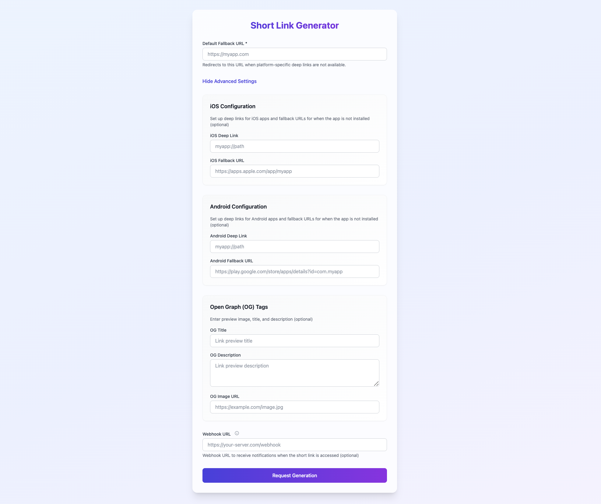

# URL Shortener Service



## Introduction

A modern URL shortening service that features deep link handling and platform-specific redirections. The service uses email verification instead of account creation for a streamlined user experience while maintaining security.

### Key Features

| Feature | Description |
|---------|-------------|
| Efficient URL Generation | Quick short link creation using a collision-free algorithm |
| Deep Link Handling | Platform detection and redirection for iOS/Android deep links |
| Email Verification | Simple URL security through email verification without account creation |
| Fallback Support | Configurable fallback URLs when apps aren't installed |
| Webhook Integration | Track link usage with real-time access logs |

### Core Technology

Our URL shortener implements an efficient system with several technical advantages.

#### Key Generation System

##### Base Conversion Algorithm
The system uses specialized `id_to_key` and `key_to_id` functions as its foundation:
```
const CHARS: &str = "abcdefghijklmnopqrstuvwxyzABCDEFGHIJKLMNOPQRSTUVWXYZ0123456789";
const BASE: i64 = 62;

/// ID To Key
/// Converts the primary key of the ShortURL table into a string.
/// Indexes when English lowercase/uppercase letters and numbers are sequentially combined.
pub fn id_to_key(mut id: i64) -> Option<String> {
    if id < 1 {
        return None;
    }
    let mut key = Vec::new();
    while id > 0 {
        id -= 1;
        let digit = (id % BASE) as usize;
        key.push(CHARS.as_bytes()[digit] as char);
        id /= BASE;
    }
    key.reverse();
    Some(key.iter().collect())
}

/// Key To ID
/// Converts arbitrary characters into a number.
/// Indexes when English lowercase/uppercase letters and numbers are sequentially combined.
pub fn key_to_id(key: &str) -> Option<i64> {
    let mut result = 0i64;
    for c in key.chars() {
        let digit = CHARS.find(c)? as i64;
        result = result * BASE + (digit + 1);
    }
    Some(result)
}

/// Split Short Key
/// Extracts the unique key in the middle and the random keys at the front and back.
pub fn split_short_key(short_key: &str) -> (String, String) {
    let front_random_key = short_key[..2].to_string();
    let back_random_key = short_key[short_key.len() - 2..].to_string();
    let random_key = &(front_random_key + &back_random_key);
    let unique_key = short_key[2..short_key.len() - 2].to_string();
    (unique_key.to_string(), random_key.to_string())
}
```

- Creates a mapping between numbers and strings using alphanumeric characters (a-z, A-Z, 0-9)
- Ensures unique string representation for each number
- Examples:
   - 1 → "a"
   - 2 → "b"
   - 27 → "A"
   - 28 → "B"
   - etc.
- Provides bidirectional mapping:
   - IDs convert to unique strings
   - Strings convert back to original IDs
   - Conversion is deterministic and collision-free

##### Short Key Generation Process
1. **Random Prefix/Suffix Generation**
   - Creates a 4-character random string
   - Splits into two 2-character segments

2. **Core Key Creation**
   - Stores URL data and receives unique ID
   - Converts ID to string using `id_to_key`
   - Combines parts: `{2-char-prefix}{converted-id}{2-char-suffix}`

3. **Key Structure Example**
   ```
   If random key = "ABCD" and ID = 12345:
   - Prefix = "AB"
   - Converted ID = id_to_key(12345)
   - Suffix = "CD"
   Final key = "AB{converted-id}CD"
   ```

#### Technical Benefits

1. **Uniqueness**
   - Each database ID creates a unique key
   - No collision checking needed
   - Random prefix/suffix adds security

2. **Performance**
   - Consistent key generation time
   - Stable performance as database grows
   - No retry loops needed

3. **Scalability**
   - Handles large URL volumes efficiently
   - No practical limit on unique keys
   - Suitable for high-traffic use

4. **Implementation Benefits**
   - Memory efficient
   - Minimal database queries
   - Easy maintenance
   - Clear debugging process

5. **Security**
   - Unpredictable keys through random elements
   - Protection against sequential guessing
   - Balanced security and URL length

## Tech Stack

### Development Stack
- Rust (backend)
- HTML (frontend)

### Libraries

| Library | Version | Purpose |
|---------|---------|---------|
| axum | 0.8.1 | Web framework |
| tokio | 1.0 | Async runtime |
| rusqlite | 0.32.1 | SQLite integration |
| lettre | 0.11 | Email handling |
| serde | 1.0 | JSON processing |

## API Reference

### Endpoints

#### 1. `GET /`
- Web interface for URL creation
- URL submission and customization UI

#### 2. `POST /v1/urls`
Creates short URLs through:
1. **Input Validation**
   - URL format and accessibility checks

2. **URL Processing**
   - Combines platform-specific URLs
   - Generates unique hash

3. **Email Verification**
   - For existing URLs:
      - Returns verification status
      - Resends verification if pending
   - For new URLs:
      - Creates unverified URL
      - Sends verification email
      - Fetches og tags if not provided

#### 3. `GET /v1/verify/{code}`
Handles verification:
1. **Code Validation**
   - Checks code validity
   - Verifies expiration status

2. **Status Update**
   - Updates verification status
   - Removes used code
   - Confirms verification

#### 4. `GET /{short_key}`
Manages redirects:
1. **Cache Check**
   - Queries Redis for URL data

2. **Cache Hit Process**
   - Direct URL redirect
   - Async webhook for analytics
   - Platform-specific routing

3. **Cache Miss Process**
   - Database retrieval
   - Cache update
   - User redirect
   - Analytics webhook

## Getting Started

1. Clone the repository:
   ```bash
   git clone https://github.com/lee-lou2/rust-url-shortener
   ```

2. Configure environment variables:
   ```env
   SERVER_HOST=127.0.0.1
   SERVER_PORT=3000
   DATABASE_URL=sqlite://sqlite3.db

   EMAIL_ADDRESS=
   EMAIL_USER_NAME=
   EMAIL_PASSWORD=
   EMAIL_HOST=
   EMAIL_PORT=
   ```

3. Set up email templates:
   - Configure `templates/verify/error.html`
   - Configure `templates/verify/failed.html`
   - Update email address from default `your@email.com`

4. Initialize the database:
   ```bash
   sh init_database.sh
   ```

5. Run the project:
   ```bash
   cargo run
   ```

## Future Development

- Platform-specific handling improvements
- Email template enhancements
- Admin dashboard
- Analytics features
- Test coverage expansion
- Docker support

## Contributing

We welcome contributions. To contribute:

1. Fork the repository
2. Create your feature branch
3. Submit a pull request

## License

This project is under the MIT License - see LICENSE for details.

## Support

For assistance:

1. Review existing issues
2. Open a new issue with details
3. Participate in community discussions

Thank you for your interest in our URL Shortener Service.